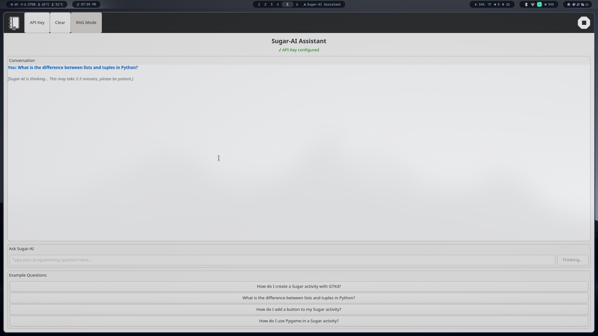
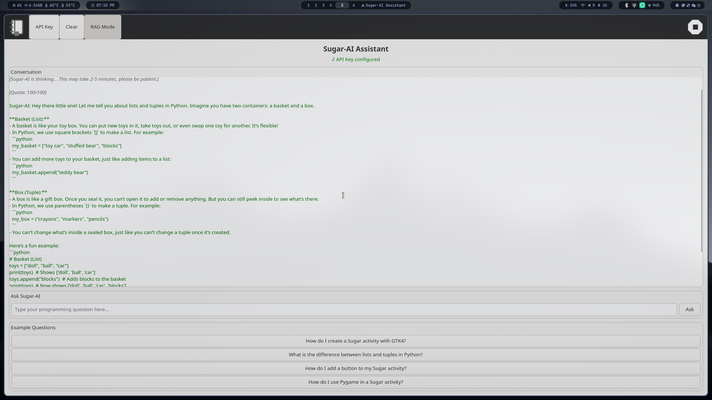

# Sugar-AI Activity

Dashboard from ai.sugarlabs.org but in an activity.

## Overview

Sugar-AI Activity provides an interactive interface to the Sugar-AI API, helping students and teachers learn programming with child-friendly AI assistance. Users can ask questions about Python, GTK, Sugar activities, and receive educational explanations.

## Getting Started

### Prerequisites

- Sugar environment with GTK4 support
- Internet connection for API access
- Sugar-AI API key (request at <https://ai.sugarlabs.org/request-key>)

### Installation

1. Clone or download this activity to your Sugar activities directory
2. Run the activity from Sugar or use the local development mode

### Local Development

To run the activity locally for development:

```bash
cd sugar-ai-activity
python3 main.py
```

### API Key Setup

1. Visit <https://ai.sugarlabs.org/request-key>
2. Fill out the API key request form
3. Wait for approval or login via Google
4. Click the "API Key" button in the activity toolbar
5. Enter your API key in the configuration dialog

## Usage

1. **Configure API Key**: First, set up your Sugar-AI API key using the toolbar button
2. **Ask Questions**: Type programming questions in the input field
3. **Toggle RAG Mode**: Use the RAG Mode button to switch between enhanced and direct responses
4. **Clear Chat**: Use the Clear button to start fresh
5. **Try Examples**: Click on example questions to get started

**Note**: Sugar-AI responses can take 2-5 minutes to generate, especially for complex questions. If the server experiences timeouts (504 errors), the activity will automatically retry up to 3 times with increasing delays. Please be patient while the AI processes your request.

## Screenshots

- Waiting:


- Answer:


## API Integration

This activity integrates with the Sugar-AI API using two endpoints:

- `/ask` - RAG-enhanced responses with context from Sugar documentation
- `/ask-llm` - Direct language model responses

All requests require a valid API key in the `X-API-Key` header.

## Troubleshooting

### Common Issues

**504 Gateway Timeout Errors**:

- The Sugar-AI service is experiencing high load
- The activity will automatically retry up to 3 times
- Wait for the retries to complete or try again later

**Invalid API Key Errors**:

- Verify your API key is correct
- Check that your key has been approved
- Request a new key if needed

**Connection Errors**:

- Check your internet connection
- Verify the Sugar-AI service is accessible at ai.sugarlabs.org

**Long Response Times**:

- Normal response times are 2-5 minutes
- Complex questions may take longer
- The activity will wait up to 5 minutes per attempt

## License

This program is free software; you can redistribute it and/or modify it under the terms of the GNU General Public License as published by the Free Software Foundation; either version 2 of the License, or (at your option) any later version.

## Contributing

Contributions are welcome! Please feel free to submit issues, feature requests, or pull requests.

## Support

For support with the Sugar-AI Activity, please visit:

- Sugar Labs community: <https://www.sugarlabs.org/>
- Sugar-AI website: <https://ai.sugarlabs.org/>
